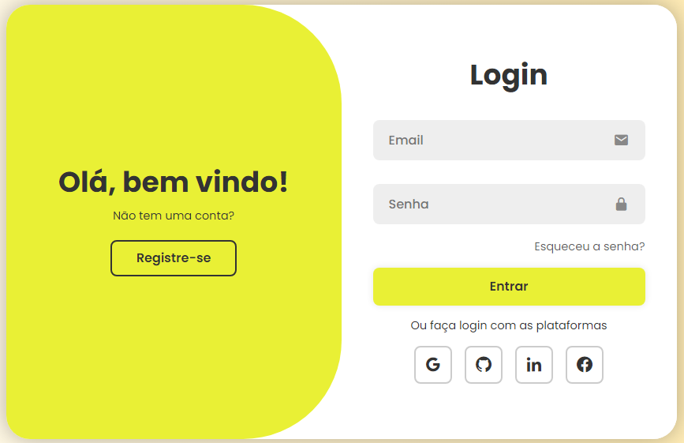

# 🛡️ Formulário de Login

Um formulário de login moderno e responsivo com funcionalidades de validação, registro de novos usuários e feedback visual para erros e sucessos. Ideal para aplicações web que buscam uma interface elegante e funcional.

---

## 📋 Funcionalidades

- **Login**:
  - Validação em tempo real de email e senha.
  - Feedback visual para erros (ex: email inválido ou senha muito curta).
  - Mensagem de sucesso ao fazer login.

- **Registro de Usuário**:
  - Cadastro de novos usuários com validação de email e senha.
  - Armazenamento local dos usuários usando `localStorage`.
  - Prevenção de duplicação de emails registrados.

- **Interface Interativa**:
  - Animações suaves para alternar entre telas de login e registro.
  - Suporte a login rápido com plataformas como Google, GitHub, LinkedIn e Facebook (links fictícios).

---

## 🎨 Prévia

<div align="center">
  
</div>

---

## 🚀 Como Usar

1. **Clone o Repositório**
   ```bash
   git clone https://github.com/LansyLord/login-form.git
   cd formulario-login

2. **Abra o Arquivo no Navegador**
   - Localize o arquivo `index.html` no diretório do projeto.
   - Clique duas vezes para abrir no navegador ou utilize uma extensão de servidor local no VS Code, como o "Live Server".

3. **Interaja com o Formulário**
   - **Login**: Insira um email e uma senha para autenticar (utilize credenciais previamente registradas).
   - **Registro**: Crie uma nova conta preenchendo nome, email e senha. Certifique-se de que as validações sejam atendidas.

---

## 🛠️ Tecnologias Utilizadas

- **HTML5**: Estrutura do formulário.
- **CSS3**: Estilo e animações.
- **JavaScript (Vanilla)**: Funcionalidades interativas e manipulação do `localStorage`.
- **Google Fonts**: Fonte "Poppins" para uma estética moderna.
- **Boxicons**: Ícones usados na interface.

---

## 📜 Licença

Este projeto está licenciado sob a [MIT License](LICENSE).

---

## 💡 Autor

- **Seu Nome**: [@lansylord](https://github.com/lansylord)

Feito com ❤️ para tornar o login mais elegante e funcional!
